# EASE: Continuous Simplex Commitment for Multi-Target Allocation and Motion Control

[](LICENSE)
[]()
[]()
[]()
[]()
[]()

Official project repository and open-source visual evaluation suite for:

> **Continuous Simplex Commitment for Multi-Target Allocation and Motion Control**  
> *Under Review at Robotics and Autonomous Systems (Elsevier)*  
> *Authors: Wang Chen (王琛) et al.*

---

## 🌟 Research Highlights

- **Continuous Simplex Commitment Interface**: Replaces brittle discrete target assignments with continuous probability simplex dynamics $\mathbf{a}_i \in \Delta^{M-1}$. By continuously blending target-dependent guidance velocity fields $\mathbf{v}_i^{\text{des}} = \sum_{j=1}^M a_{ij} \mathbf{v}_{ij}$, the framework eliminates boundary chattering, target thrashing, and high-frequency combinatorial re-computations.
- **Count-Adaptive Standoff Formation**: Dynamically adjusts multi-target encirclement ring radii based on local target threat weights and assigned subgroup quotas ($n^*_j$), ensuring uniform chordal packing and balanced angular coverage across diverse target counts.
- **Deadlock-Free Circulation Bypass & Density-Gated Merging**: Introduces latched tangential circulation around static obstacles and foreign target exclusion zones to break collinear force deadlocks, coupled with density-gated spiral entry to guarantee rapid ring convergence without outer limit-cycle orbits.
- **Target-Core Standoff Safety Projection**: Integrates active acceleration barrier filtering that treats target entities as protected cores ($d_{\min} \ge \max(4r_{\text{body}}, 2r_{\text{body}} + V_{\max}\Delta t)$), preventing transient vehicle penetration and overshoot while preserving smooth asymptotic ring closure.
- **24-Dimensional Similitude Envelope via Active CMA-ES**: Normalizes vehicle kinematics and operational geometries through dimensionless $\Pi$-groups under similitude scaling. An offline Active CMA-ES calibration discovers globally robust envelope parameters under racing evaluations, enabling zero-shot transfer from nominal teams ($N=8, 18, 40$) to ultra-dense large swarms ($N=80$) without re-tuning.

---

## 🌐 Full Paper Evaluation Galleries (18 Benchmark Rollouts)

### 1. Center-Launch Encirclement Allocation Suite (Paper Fig. 3 Matrix)

Evaluates continuous self-organizing allocation and count-adaptive encirclement from a centralized launch cluster under both uniform and graded threat distributions across $M \in \{2, 3, 4, 5\}$ maneuvering targets.

#### Row 1: Uniform Threat Family ($n^* = 4$ Quadrotors per Target)
| (a) $M=2$ ($N=8, n^*=4:4$) | (b) $M=3$ ($N=12, n^*=4:4:4$) | (c) $M=4$ ($N=16, n^*=4:4:4:4$) | (d) $M=5$ ($N=20, n^*=4:4:4:4:4$) |
| :---: | :---: | :---: | :---: |
| 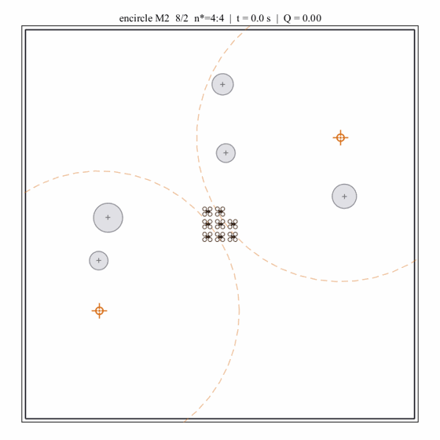 | 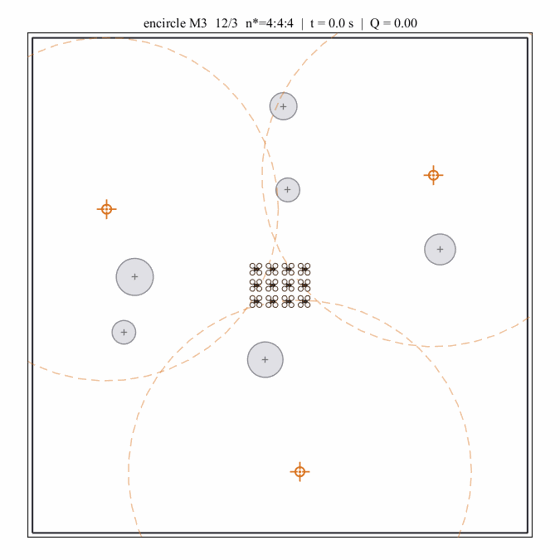 | 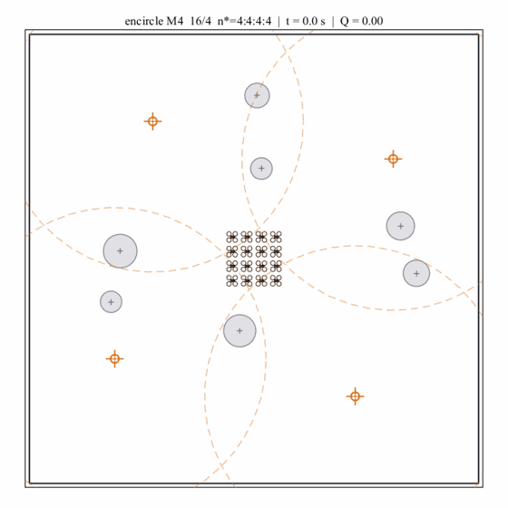 | 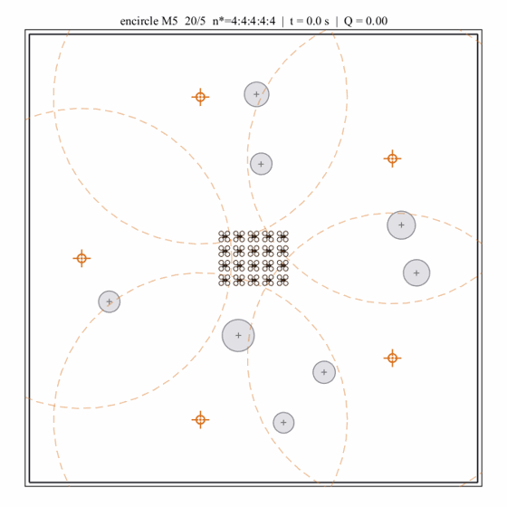 |
| `ease_encircle_eq_m2.gif` | `ease_encircle_eq_m3.gif` | `ease_encircle_eq_m4.gif` | `ease_encircle_eq_m5.gif` |

#### Row 2: Graded Threat Ladder Family ($n^* = 4:8:\dots$)
| (e) $M=2$ ($N=12, n^*=4:8$) | (f) $M=3$ ($N=24, n^*=4:8:12$) | (g) $M=4$ ($N=40, n^*=4:8:12:16$) | (h) $M=5$ ($N=60, n^*=4:8:12:16:20$) |
| :---: | :---: | :---: | :---: |
| 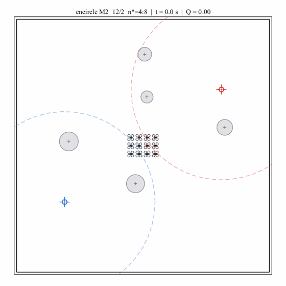 | 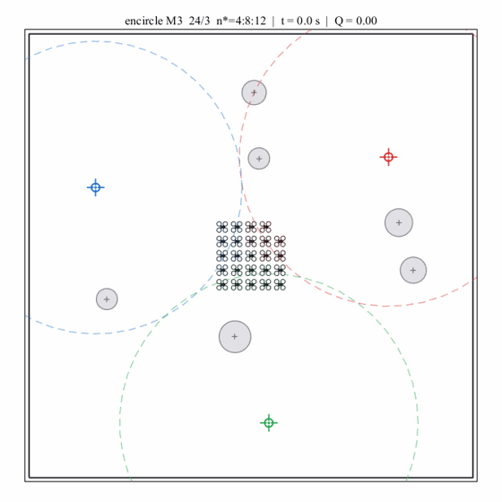 | 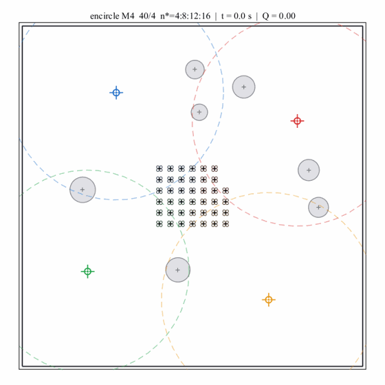 | 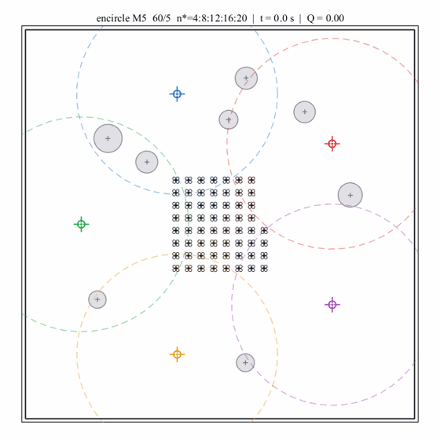 |
| `ease_encircle_gr_m2.gif` | `ease_encircle_gr_m3.gif` | `ease_encircle_gr_m4.gif` | `ease_encircle_gr_m5.gif` |

> *Observations: (1) Symmetrical versus asymmetric flow splitting emerges autonomously from simplex dynamics. (2) Ring radii adapt cleanly to local counts ($r^*(n^*_j)$), maintaining safe inter-vehicle angular packing. (3) Zero assignment thrashing or boundary oscillations occur during the entire outward expansion.*

---

### 2. Expendable Interception Tactical Engagement Suite (Paper Fig. 7 Matrix)

Evaluates one-shot kinetic interception against agile intruders under high speed, cluttered obstacles, and dynamic threat corridors across swarm scales S, M, L, and XL ($N \in \{9, 12, 16, 24\}$, $M \in \{6, 9, 12, 16\}$).

#### Row 1: Scenario 1 (Nominal Perimeter Ingress & Evasion)
| (a) Scale S ($N=9, M=6$) | (b) Scale M ($N=12, M=9$) | (c) Scale L ($N=16, M=12$) | (d) Scale XL ($N=24, M=16$) |
| :---: | :---: | :---: | :---: |
| 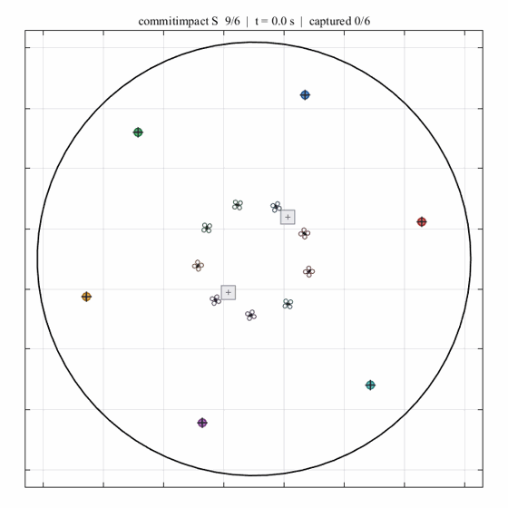 | 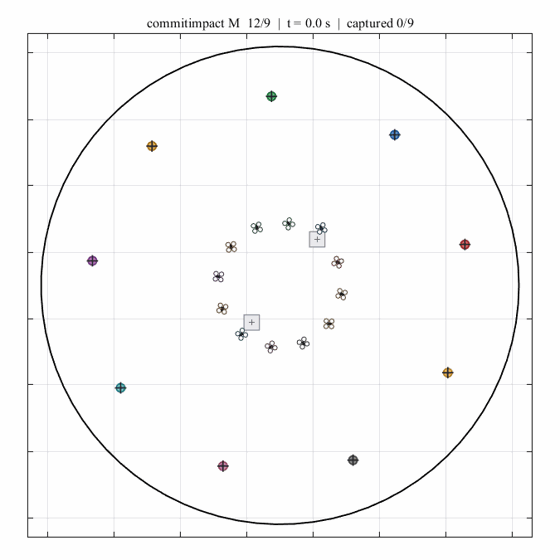 | 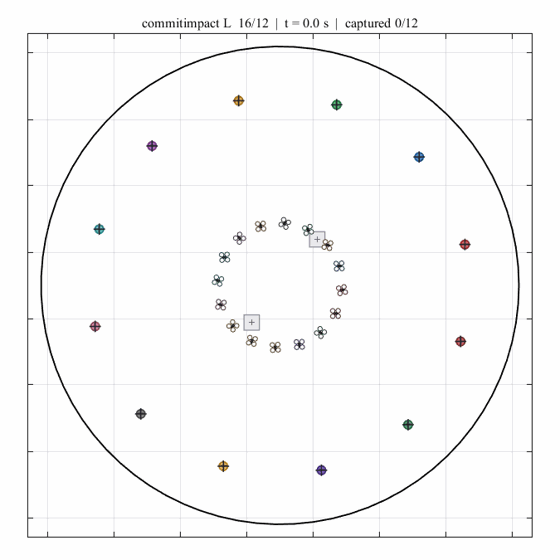 | 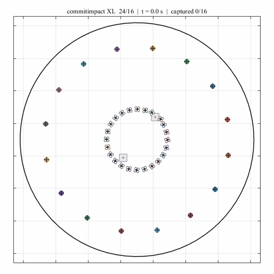 |
| `ease_impact_s1_s.gif` | `ease_impact_s1_m.gif` | `ease_impact_s1_l.gif` | `ease_impact_s1_xl.gif` |

#### Row 2: Scenario 2 (Complex Heterogeneous Evasion: Serpentines, Loitering & Dynamic Zones)
| (e) Scale S ($N=9, M=6$) | (f) Scale M ($N=12, M=9$) | (g) Scale L ($N=16, M=12$) | (h) Scale XL ($N=24, M=16$) |
| :---: | :---: | :---: | :---: |
| 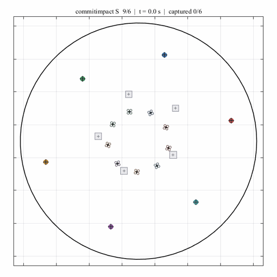 | 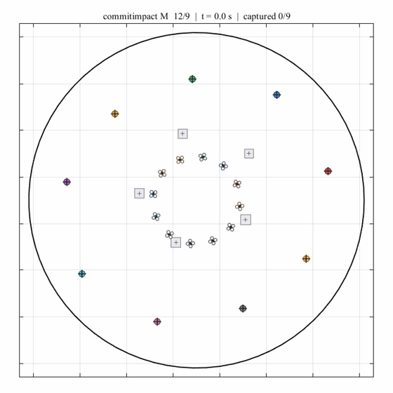 | 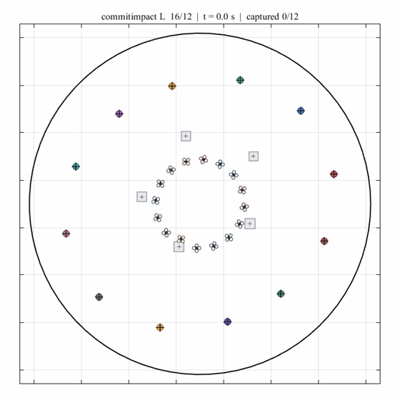 | 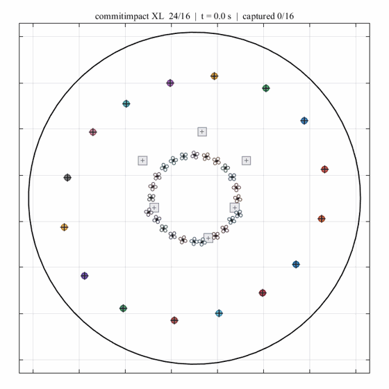 |
| `ease_impact_s2_s.gif` | `ease_impact_s2_m.gif` | `ease_impact_s2_l.gif` | `ease_impact_s2_xl.gif` |

> *Observations: (1) Interceptors negotiate static square hazards and moving threat exclusion bubbles without losing pursuer-to-evader lock. (2) Expended interceptors leave permanent flight trails and 5-pointed collision starbursts at impact points. (3) Surviving interceptors seamlessly re-orient to remaining high-threat penetrators.*

---

### 3. Macro Benchmark & Extreme Density Stress Demonstrations

#### Task 1: Five-Target Count-Adaptive Encirclement ($N = 40, M = 5$)
Multi-target encirclement benchmark under non-uniform quota allocation and cluttered obstacle fields.

<p align="center">
  
</p>

> *(a) **Non-Uniform Quotas** ($M=5$): Self-organizing distribution satisfying target threat proportions ($n^* = [8, 12, 6, 14, \dots]$). (b) **Dynamic Color Blending**: Triangle glyph colors continuously represent simplex commitment weights $\mathbf{a}_i$. (c) **Deadlock-Free Bypass**: Latched tangential curl routes vehicles around obstacle clusters without collinear stalls. (d) **Core Protection**: Zero target-core penetration ($d_{\min}^{\text{tar}} = 0.641\,\text{m} > 2r_{\text{body}}$).*

#### Task 2: Large-Scale Ultra-Dense Encirclement ($N = 80, M = 5$)
Extreme swarm density stress test evaluating high-flux obstacle navigation, collision avoidance, and multi-ring convergence.

<p align="center">
  
</p>

> *(a) **High-Density Swarm** ($N=80$): High flux coordination through narrow obstacle corridors. (b) **Radial-Priority Entry**: Density-gated spiral merge guides outer vehicles into inner rings, eliminating outer circling traps. (c) **Scale-Invariant Closure**: Sustained high quota satisfaction ($Q \approx 0.749$) with zero permanent stalls and zero collisions across all 80 agents.*

---

## 🎬 Multi-Scale Trajectory Rollouts & Quantitative Benchmark Evidence

| Benchmark Task | Scenario Configuration | Rollout Asset | Closed-Loop Performance & Emergent Physical Mechanism |
| :--- | :---: | :---: | :--- |
| **Encircle: Equal Threat Matrix**<br>*(Paper Fig. 3, Row 1)* | $M \in \{2, 3, 4, 5\}$<br>$N \in \{8, 12, 16, 20\}$<br>$n^* = 4$ each target | 4 Rollout GIFs<br><code>ease_encircle_eq_m*.gif</code> | **Balanced Simplex Bifurcation**: Swarm splits evenly into symmetric clusters with identical standoff radii; zero angular chattering ($\text{CV} < 0.10$). |
| **Encircle: Graded Ladder Matrix**<br>*(Paper Fig. 3, Row 2)* | $M \in \{2, 3, 4, 5\}$<br>$N \in \{12, 24, 40, 60\}$<br>$n^* = 4:8:12:\dots$ | 4 Rollout GIFs<br><code>ease_encircle_gr_m*.gif</code> | **Threat-Weighted Simplex Packing**: Continuous self-excitation aligns subgroup densities with target threat levels, automatically expanding standoff radii ($r^*(n^*_j)$) to prevent overcrowding. |
| **Interception: Scenario 1 Suite**<br>*(Paper Fig. 7, Row 1)* | Scales S/M/L/XL<br>$N \in \{9, 12, 16, 24\}$<br>$M \in \{6, 9, 12, 16\}$ | 4 Rollout GIFs<br><code>ease_impact_s1_*.gif</code> | **High-Efficiency Perimeter Defense**: Rapid multi-target point interception with zero pairwise pursuer collision ($d_{\min} > 2r_{\text{body}}$); starburst contact points mark positive kinetic kills. |
| **Interception: Scenario 2 Suite**<br>*(Paper Fig. 7, Row 2)* | Scales S/M/L/XL<br>$N \in \{9, 12, 16, 24\}$<br>$M \in \{6, 9, 12, 16\}$ | 4 Rollout GIFs<br><code>ease_impact_s2_*.gif</code> | **Robust Defense Against Agile Evasion**: Successfully neutralizes serpentine evaders, loiterers, and feints around dynamic keep-out bubbles with zero permanent deadlocks. |
| **Macro Benchmark: Five-Target**<br>*(Unequal Threat Quotas)* | $N=40$ Quadrotors<br>$M=5$ Moving Targets<br>Cluttered Obstacles | 1 Rollout GIF<br><code>ease_encircle_five_target_seed21.gif</code> | **Smooth Simplex Commitment & Zero Thrashing**: Continuous logit dynamics seamlessly split the swarm into assigned quotas ($Q \approx 0.923$, zero stalls, target clearance $\ge 0.641\,\text{m}$). |
| **Macro Stress: Ultra-Dense**<br>*(Scale Limit Test)* | $N=80$ Quadrotors<br>$M=5$ Moving Targets<br>Narrow Corridors | 1 Rollout GIF<br><code>ease_encircle_n80_seed21.gif</code> | **High-Density Deadlock-Free Ring Entry**: Density-gated spiral merging and finite-time tangential bypass prevent outer-ring limit cycles ($Q \approx 0.749$, $d_{\min} = 0.270\,\text{m} > 2r_{\text{body}}$). |

---

## 📋 Method Architecture & Core Mechanisms

```text
               +-------------------------------------------------------+
               |          EASE Closed-Loop Control Architecture        |
               +-------------------------------------------------------+
                                           |
      +------------------------------------+-----------------------------------+
      |                                    |                                   |
      v                                    v                                   v
+------------------------+   +---------------------------+   +---------------------------------+
| Continuous Simplex     |   | Count-Adaptive Guidance   |   | Safety & Deadlock Bypass        |
| Commitment Dynamics    |   | Potential Fields          |   | Acceleration Filtering          |
+------------------------+   +---------------------------+   +---------------------------------+
| • State a_i in Delta   |   | • Quota-scaled radius r*  |   | • Latched obstacle circulation  |
| • Logit self-excitation|   | • Tangential/radial blend |   | • Density-gated spiral entry    |
| • Cross-agent entropy  |   | • Continuous velocity mix |   | • Protected target-core barrier |
+------------------------+   +---------------------------+   +---------------------------------+
      |                                    |                                   |
      +------------------------------------+-----------------------------------+
                                           |
                                           v
               +-------------------------------------------------------+
               |  Offline Similitude Envelope Calibration via CMA-ES   |
               |  (24-Dim Dimensionless Parameter Optimization)        |
               +-------------------------------------------------------+
```

### 1. Continuous Simplex Commitment Dynamics
Rather than assigning each vehicle $i$ to a single target $j \in \{1,\dots,M\}$, vehicle $i$ maintains a continuous commitment probability vector $\mathbf{a}_i = (a_{i1}, \dots, a_{iM})^\top \in \Delta^{M-1}$ governed by self-exciting logit dynamics:
$$\tau_a \dot{s}_{ij} = -s_{ij} + \kappa a_{ij} + U_j(t) - \beta \sum_{k \in \mathcal{N}_i} a_{kj}, \quad a_{ij} = \frac{\exp(s_{ij})}{\sum_{m=1}^M \exp(s_{im})}$$
This continuous coupling guarantees that velocity commands $\mathbf{v}_i^{\text{des}} = \sum_{j=1}^M a_{ij} \mathbf{v}_{ij}$ change smoothly across operational regimes, entirely avoiding chattering and decision thrashing.

### 2. Count-Adaptive Guidance & Protected Target Standoff
For multi-target encirclement, the nominal standoff ring radius scales automatically with subgroup size:
$$r^*_j = \max\left(r_{\text{star}}, \frac{d_{\text{sep}}}{2\sin(\pi / n_j^*)}\right)$$
This geometric adaptation guarantees uniform angular spacing along the perimeter. To prevent transient overshoot through target centers during rapid convergence, a protected core barrier enforces $d_{ij} \ge \max(4r_{\text{body}}, 2r_{\text{body}} + V_{\max}\Delta t)$ through safe acceleration projection.

### 3. Non-Degenerate Bypass & Deadlock-Free Ring Entry
- **Latched Circulation**: Adds an orthogonal curl component ($\mathbf{n}^\perp$) to obstacle and foreign-target repulsion fields, breaking collinear equilibria where attractive and repulsive forces balance. The circulation side is latched upon entry to prevent high-frequency sign flips.
- **Density-Gated Merging**: Employs radial-priority guidance when local density is low, only activating a bounded tangential merge component when radial progress is temporarily blocked by inner-ring agents, preventing outer limit-cycle orbits.

### 4. 24-Dimensional Similitude Envelope via Active CMA-ES
Kinematics, sensing bounds, and field geometries are mapped to a 24-dimensional dimensionless vector $\bm{\Pi} \in \mathbb{R}^{24}$ invariant under physical similitude scaling. An offline Active CMA-ES calibrates this envelope under randomized multi-scenario evaluations, generating policies that transfer directly across swarm scales without re-tuning.

---

## 📂 Repository Organization

```text
├── animations/                              # Complete 18-asset visual evaluation suite
│   ├── ease_encircle_eq_m[2-5].gif          # Equal threat encirclement suite (4 GIFs)
│   ├── ease_encircle_gr_m[2-5].gif          # Graded threat ladder suite (4 GIFs)
│   ├── ease_impact_s1_[s,m,l,xl].gif        # Interception Scenario 1 suite (4 GIFs)
│   ├── ease_impact_s2_[s,m,l,xl].gif        # Interception Scenario 2 suite (4 GIFs)
│   ├── ease_encircle_five_target_seed21.gif # Five-target adaptive encirclement (1 GIF)
│   ├── ease_encircle_n80_seed21.gif         # Large-scale N=80 encirclement (1 GIF)
│   └── README.md                            # Comprehensive specification & frame metadata
├── .gitignore                               # Strict rules excluding source code and manuscripts
├── LICENSE                                  # MIT License
├── README.md                                # Project showcase and gallery documentation
└── upload_to_github.ps1                     # One-click deployment script
```

---

## 📢 Availability Note

> **Notice**: The complete algorithmic source code implementation (`code/`), parameter calibration pipelines, and the full manuscript (`paper/`) are currently under peer review. They will be fully open-sourced in this repository upon official publication.

---

## 📜 Citation

If you find this work, visual benchmarks, or control framework useful in your research, please cite:

```bibtex
@article{wang2026ease,
  title={EASE: Continuous simplex commitment for multi-target allocation and motion control},
  author={Wang, Chen and collaborators},
  journal={Robotics and Autonomous Systems},
  year={2026},
  note={Under Review}
}
```

---

## 📄 License

This repository and its visual media assets are licensed under the [MIT License](LICENSE).
