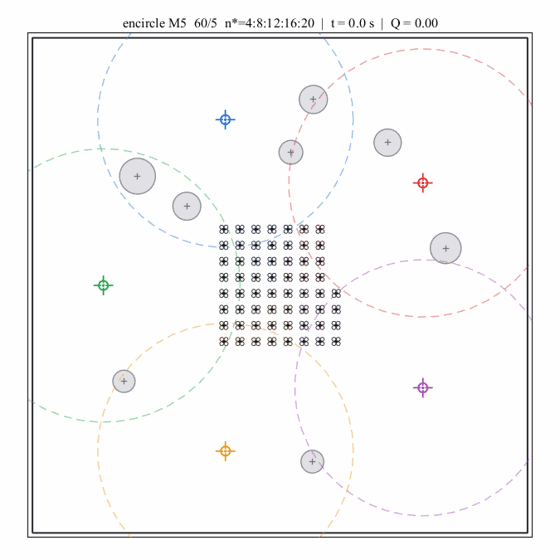
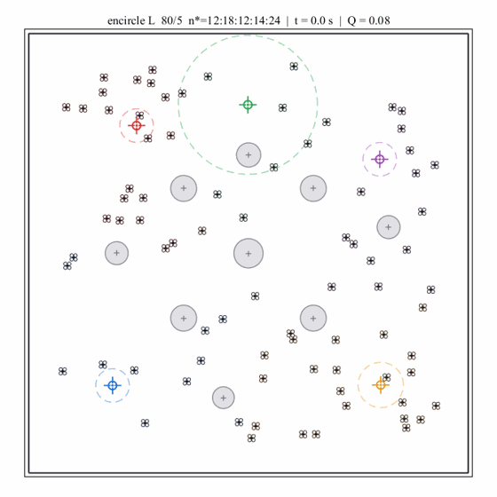

# EASE Rollout Animations

Visual rollouts for **EASE: Continuous Simplex Commitment for Multi-Target Allocation and Motion Control**.

This repository currently contains animation assets only. Source code and manuscript files are not included.

## Multi-target encirclement

### Five-target allocation and ring formation

### Large-scale encirclement with 80 UAVs

Both rollouts use hold-out seed 21 and the original fixed CMA-ES genome. The GIFs were regenerated after the controller-level deadlock-escape and target-core safety updates; no evolutionary re-optimization was performed.
